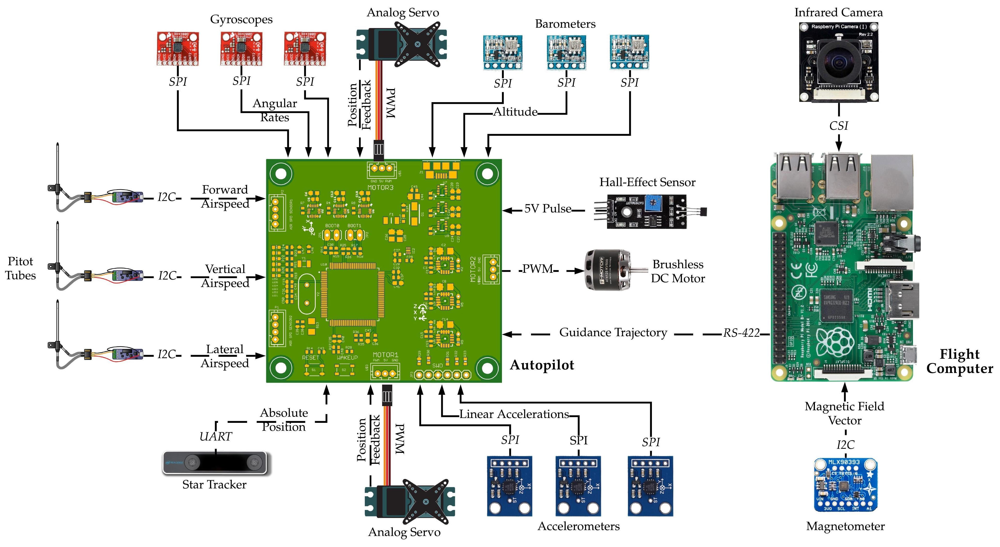

# DronesForMars

The repository includes the following:

1. Step files of the autopilot PCB, pinout diagrams and gerber files
2. XFLR5 models of the bare airframe and the elevon-augmented airframe for various deflection angles
3. Simscape models of the servo and BLDC motors used for Hardware-in-the-Loop testing
4. Simulink files for data collection and conditioning for actuator feedback and sensor data
5. Simulink implementation of the LQG autopilot 
6. Arduino implementation of the autopilot, automatically generated with Matlab Embedded Coder

And many diagrams explaining the overall architecture, system requirements, specifications and test cases.

